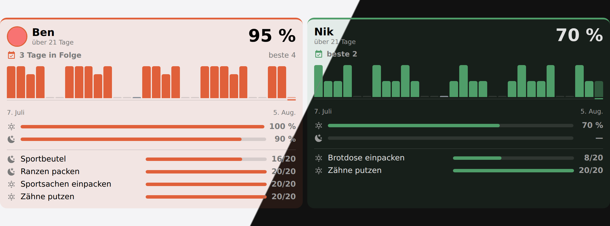
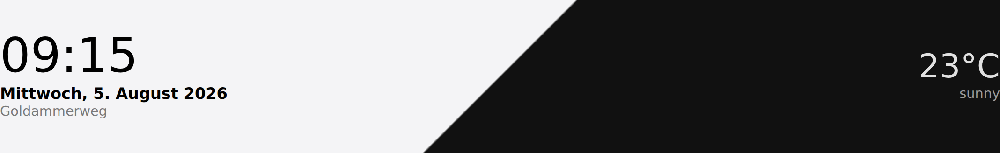
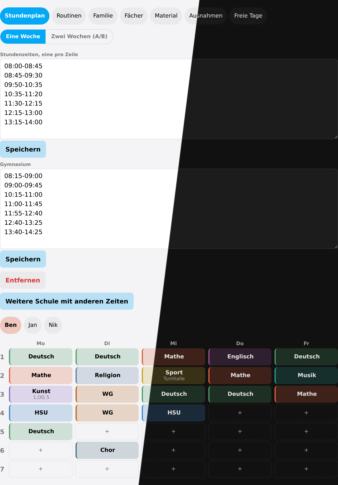
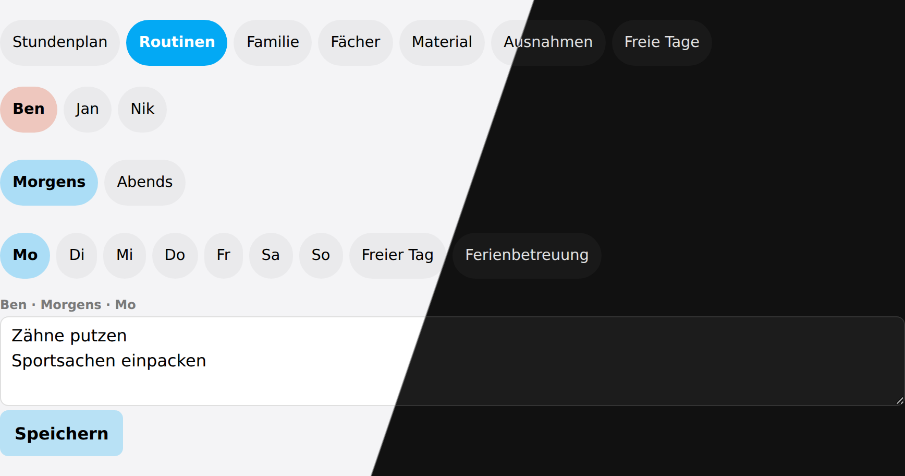
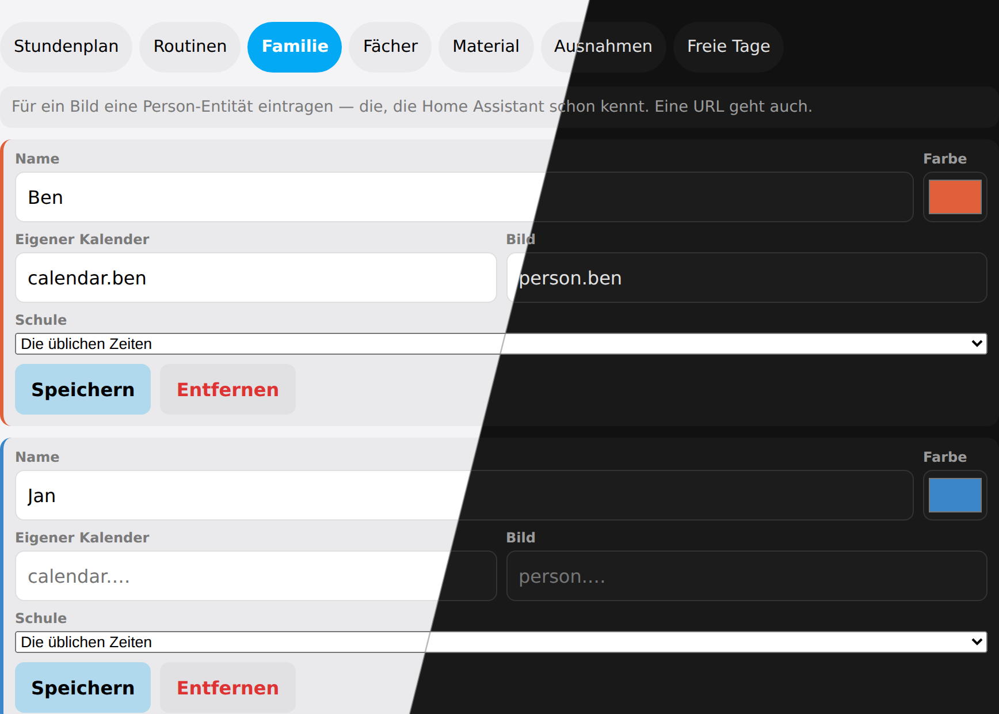
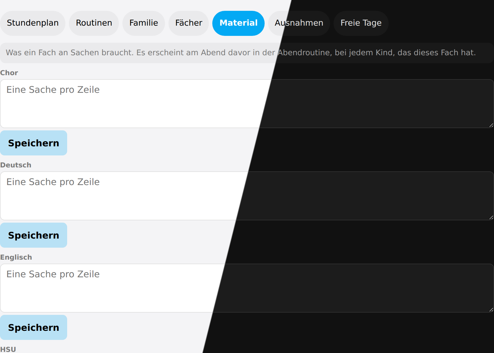
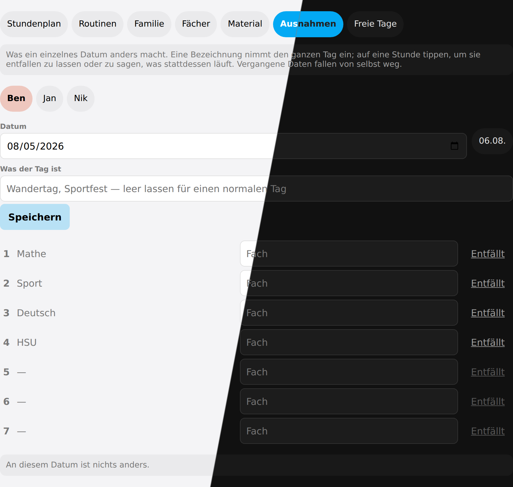
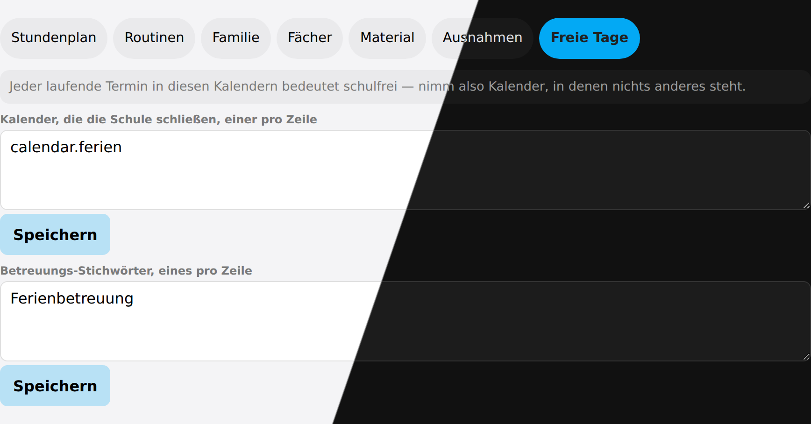

# Cards

The cards read `sensor.schoolday_board` and the per-member sensors, so **no card has to
be told who your family is**. Adding a card with no options at all is the normal case.

Every card takes `board_entity` as an escape hatch for a renamed board sensor. It is
deliberately absent from every visual editor: only one board can exist, and an entity
picker that is meant to stay empty is a question nobody should be asked.

## Timetable card

```yaml
type: custom:schoolday-timetable-card
```

The card finds the household's lesson grid, offers the members who have a timetable,
shows Monday to Friday unless somebody has weekend lessons, hides periods nobody has,
marks today and the lesson running right now, and falls back to a single day when it is
too narrow for a week.


*One child's week. Today is the highlighted column, the running lesson is outlined, and the
times and breaks come from that child's own school.*

| Option | Default | What it does |
|---|---|---|
| `member` | all | One child only, by name or id. Otherwise the card offers a switcher. |
| `layout` | `auto` | `auto` shows the week and drops to one day when narrow; `week`; `day`. |
| `week_days` | `auto` | `auto` follows the timetable; `school` is Mon–Fri; `week` is all seven. |
| `show_rooms` | `true` | The room under the subject. |
| `show_times` | `true` | The times next to the period number. |
| `show_breaks` | `true` | The break rows between the periods. |
| `hide_empty_periods` | `true` | Leave out periods that are free on every day shown. |
| `highlight` | `true` | Today, the running lesson and the "now / next" line. |
| `roll_days` | `true` | Point a weekday that has been at next week's. Off shows the week as it stands. |

Children at [two schools that ring differently](timetable.md#two-schools-that-do-not-ring-together)
each get their own rows: the card draws the grid of whichever child is on screen.

## Routines card

```yaml
type: custom:schoolday-routines-card
```

What has to happen before the door in the morning and before bed in the evening, ticked
off by the children themselves. With no member set it shows the whole family side by side,
which is what a wall panel is for.


*The whole family at once. "Sportbeutel" carries the subject that put it on the list — the
timetable generated that step rather than anybody typing it.*

| Option | Default | What it does |
|---|---|---|
| `member` | all | One child only. Unset shows the whole family side by side. |
| `block` | `auto` | `auto` switches by time of day; `morning`; `evening`; `both`. |
| `evening_from` | `14` | The hour at which `auto` flips to the evening list. |
| `show_empty` | `false` | Keep children who have nothing on today. |

A child [at home ill](exceptions.md#off-ill) stays on the board either way, with the
reason instead of a list: dropping them would answer the wrong question.

## Routine record card

```yaml
type: custom:schoolday-stats-card
```

How the routines are actually going, from [the record](routines.md#the-record) the
integration keeps. Not a card for the wall next to the routines — it is for whoever has
to decide whether the evening routine is working, which is a different question and has
never had an answer, because the ticks are wiped every midnight.



*One column per child: the rate over the window, the run of complete days, one bar per day, morning against evening, and the steps that keep being skipped*

Each bar is a day, as tall as the share of that day that got done. A day that asked for
nothing — a weekend, a holiday with no list, a day [at home ill](exceptions.md#off-ill) —
is a baseline tick rather than a short bar: it is not a day anybody failed, and it must
not read as one. Today's bar is drawn faded, because today is not over.

The list underneath is the interesting one. A routine that fails is rarely failing
everywhere at once; it is the same two steps, and they are usually the ones that belong
somewhere else in the day. Worst first, so that step is at the top rather than the bottom.

| Option | Default | What it does |
|---|---|---|
| `member` | all | One child only. Unset shows everyone who has a routine. |
| `days` | `30` | How far the strip reaches back. Thirty is everything the integration keeps. |
| `show_steps` | `true` | The tally per step under the bars. |
| `sort` | `board` | `board` keeps the family's usual order; `rate` puts the best record first. |

Ranking is deliberately **opt-in**. A wall panel whose columns move about from one day to
the next is harder to read than one that does not, and the percentages compare perfectly
well standing still.

A child with no routine at all is left off the card rather than reported as 0 %: they were
never asked for anything, and failing to do nothing is not a thing that happened.

## Homework card

```yaml
type: custom:schoolday-homework-card
```

Each child's [homework](homework.md) grouped by when it is due, soonest group first, ticked
off on the card. It draws a Home Assistant todo list, so the same items are reachable by
voice and from the todo panel.


*Grouped by when it is due. The number beside each name is what is still open.*

| Option | Default | What it does |
|---|---|---|
| `member` | all | One child only. |
| `show_done` | `false` | Show what is already finished. |
| `show_empty` | `false` | Keep children with nothing to do. |

## Header card

```yaml
type: custom:schoolday-header-card
weather_entity: weather.home
```

Clock, date and weather — the strip along the top of a wall panel.



*Clock, date and weather along the top of a wall panel*

| Option | Default | What it does |
|---|---|---|
| `weather_entity` | — | Which weather to show. Omit for no weather. |
| `greeting` | — | A word after the greeting, usually the household's name. |
| `show_seconds` | `false` | Seconds on the clock. |

## Admin card

```yaml
type: custom:schoolday-admin-card
```

Everything the options dialog can change, on the dashboard: the timetable, routines, the
family, subject colours, materials, exceptions and days off. Finding the integration page
to move one lesson is more ceremony than the job deserves.

The card **never writes the configuration itself.** It calls a service, and the service
decides whether the value is allowed — so there is one set of rules and not two, and a
refused value comes back as a readable reason.

| Option | Default | What it does |
|---|---|---|
| `section` | `timetable` | Which section to open on. |

### Timetable


*The household's lesson times at the top, another school's under them, and the week below.
Tap a cell to set a lesson; with a two-week timetable the cycle and an A/B switch sit above
the grid.*

The lesson times live at the top of this section, and under them any
[other school's](timetable.md#two-schools-that-do-not-ring-together) — for a household
whose children are at two that do not ring at the same minute. A child is put on one in
the **Family** section.

### Routines


*One block, one day at a time — including the two kinds of day off*

### Family


*Name, colour, the calendar searched for the holiday-care keyword, a picture taken from a
person entity, and which school's lesson times they ring to. The last of those only appears
once there is more than one school to choose between.*

### Material


*One box per subject. These become the evening packing list on the day before.*

### Exceptions


*One date at a time: a name takes the whole day, or a single period is cancelled or covered*

### Days off


*Holiday calendars are picked as entities; the care keywords stay the household’s own words*


## Restyling with card-mod

Every card is a Lit element with **one shadow root**, and nothing inside it is a nested
custom element of Schoolday's own. That is what makes
[card-mod](https://github.com/thomasloven/lovelace-card-mod) work here: the `<style>` it
appends lands in the same shadow root everything is drawn in, so a selector reaches its
target without any `$` piercing.

```yaml
type: custom:schoolday-routines-card
card_mod:
  style: |
    ha-card {
      --schoolday-radius: 4px;
      --schoolday-muted: #888;
    }
```

### The variables

They are declared once, in `src/lib/styles.ts`, and every card reads the same ones. Each
of the four that borrow from Home Assistant follows your theme unless you say otherwise —
setting one here overrides it for Schoolday alone.

| Variable | Default | What it colours or sizes |
|---|---|---|
| `--schoolday-gap` | `8px` | The space between children on the family cards |
| `--schoolday-radius` | `12px` | The corner of every panel inside a card |
| `--schoolday-touch` | `44px` | The smallest a tappable thing is allowed to get. Lower it and a wall tablet gets harder to hit |
| `--schoolday-muted` | `--secondary-text-color` | Secondary text: counters, captions, the "nothing today" line |
| `--schoolday-line` | `--divider-color` | Rules, bar tracks, empty meters |
| `--schoolday-surface` | `--card-background-color` | What a tinted panel is tinted *against* |
| `--schoolday-surface-alt` | `rgba(127,127,127,.08)` | The quieter panel: an ill child's block, a pressed button |
| `--schoolday-today` | `--primary-color` | Today's column, the running lesson, the pressed segment |
| `--schoolday-holiday` | `#b08d57` | A day off |
| `--schoolday-care` | `#2f7f8f` | A day in holiday care |
| `--schoolday-sick` | `#8a8f98` | A child at home ill |
| `--schoolday-event` | `#7a5ea8` | A day the school took over — a trip, a sports day |

The last four are deliberately **not** from the subject palette: a day off is not a
subject, and nobody should have to wonder whether the sand-coloured block is a holiday or
somebody's Art lesson.

### Two colours that are data, not styling

`--member-color` and `--subject` are set **inline**, per element, from what the integration
holds — a child's colour and a subject's colour. Change those in Schoolday itself
(**Family** and **Subjects** in the [admin card](#admin-card)) and every card follows at
once, which is the point of them living there.

A card-mod rule can still override them, but it needs `!important`, like any rule against
an inline style.

### Rules on classes need `!important`

Not a matter of specificity — of cascade order. Lit adopts its styles as constructable
stylesheets, and those come **after** a `<style>` element in the same shadow root, so at
equal specificity the card wins:

```yaml
card_mod:
  style: |
    .step { background: rgb(0, 128, 0) !important; }
```

The smoke suite checks both halves of this — that the variables can be overridden and that
a class rule needs the `!important` — so neither can quietly stop being true.

### The classes worth targeting

Stable enough to write a rule against; the ones not listed are layout scaffolding that may
move.

| Card | Classes |
|---|---|
| Timetable | `.title` `.chips` `.chip` `.grid` `.col-day` `.col-date` `.cell` `.subject` `.room` `.time` `.t-break` `.status` `.closure` |
| Routines | `.person` `.person-name` `.avatar` `.block` `.block-head` `.progress` `.bar` `.bar-fill` `.step` `.label` `.from` `.sick-note` |
| Routine record | `.person` `.person-head` `.name` `.rate` `.window` `.streak` `.strip` `.day` `.axis` `.row` `.meter` `.meter-fill` `.value` |
| Homework | `.person` `.bucket` `.bucket-head` `.item` `.label` `.due` `.count` |
| Header | `.clock` `.date` `.greeting` `.weather` `.temperature` `.condition` |
| Admin | `.tabs` `.field` `.row` `.apply` `.danger` `.notice` `.error` |

## Language

The cards follow **Home Assistant's own language** rather than a card option, so a German
household gets a German wall panel without configuring anything. English is the fallback,
key by key.

Shipped today: **German** and **English**. A third is a translation file and one block in
`src/lib/i18n.ts` — no code changes.
