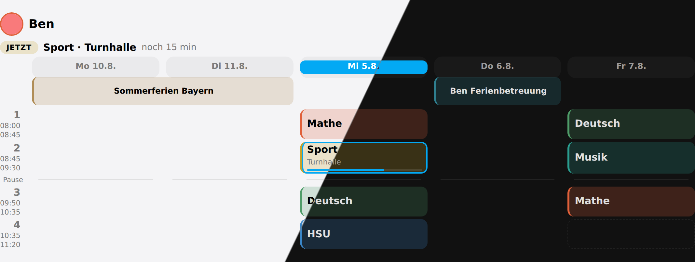
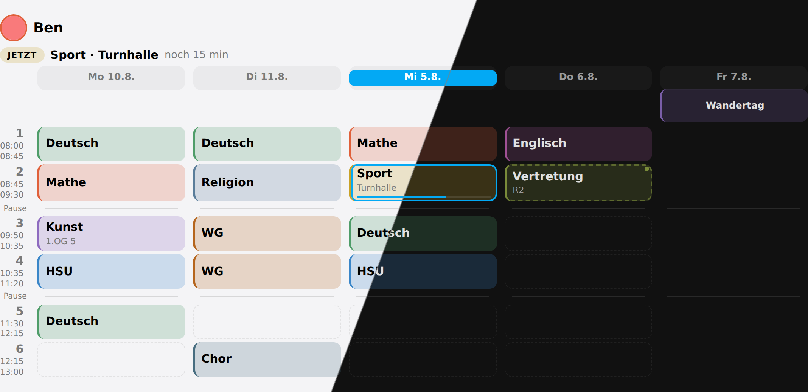
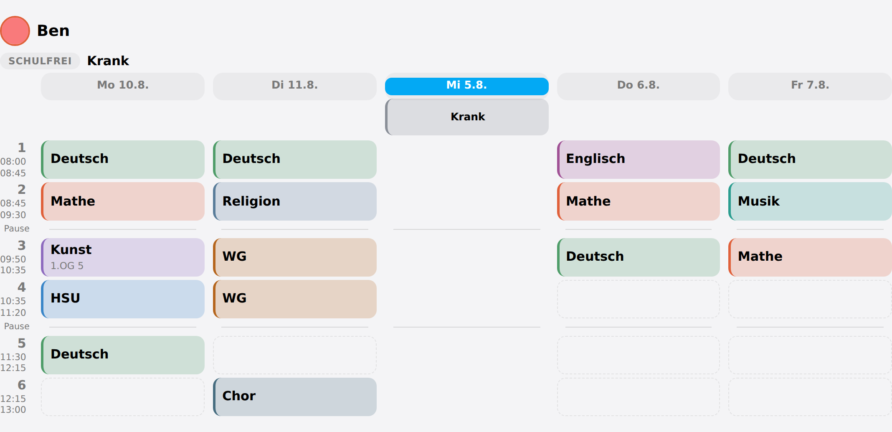

# Days that differ

Four different things can stop a day being an ordinary school day, and Schoolday keeps
them apart because they mean different things and are drawn differently.

| | Whose day | Where it comes from |
|---|---|---|
| **Holiday** | Everyone's | A calendar you name |
| **Holiday care** | One child's | A keyword on that child's own calendar |
| **A day the school took over** | One child's | Typed in, per date |
| **Off ill** | One child's | A switch |

## Holidays

Name one or more calendars that hold **nothing but days off** — school holidays, teacher
training days. The contract is deliberately blunt: **any** event running on those
calendars closes the school. That is why the option asks for calendars with nothing else
in them.

### Making one

Home Assistant's built-in **Remote Calendar** subscribes to an ICS feed and keeps it
read-only, which is exactly what a holiday calendar should be — nobody should be able to
delete the summer holidays by fat-fingering a card.

1. **Settings → Devices & Services → Add integration → Remote Calendar**
2. Give it a name — `Schulferien Bayern`, or whatever your region is called
3. Paste the **ICS URL** of a school-holiday feed for your state or country

That produces `calendar.schulferien_bayern` or similar, and that is what goes in the
**Days off** field.

Where the URL comes from depends on where you live. In Germany several free services
publish a per-state `.ics`; in other countries the education ministry or the school
itself often does. What matters is not which one you pick but that it passes both of
these:

- **Only days off in it.** Any event closes the school, so a feed that also carries term
  dates or "first day back" markers will close school on days there is school. Open it
  once and look.
- **It reaches far enough ahead.** A feed that stops at the end of this school year
  quietly stops closing the school in August. Check the last event before you trust it.

### Checking it worked

The board sensor answers this directly. In **Developer tools → Template**:


```jinja
{{ state_attr('sensor.schoolday_ben', 'outlook') }}
```


Every day in the window comes back with its `mode`. A holiday reads `free`, and the
holiday's own name comes with it.



*A holiday spans its columns as one block; a day in holiday care gets its own colour*

## Holiday care

A holiday spent in care is not a holiday at home: the child is out of the house and needs
a lunchbox. Schoolday spots it by looking at **that child's own calendar** for a keyword
you choose — `Ferienbetreuung`, `Hort`, whatever your household calls it, matched
case-insensitively anywhere in the title.

Their own calendar also holds the dentist and football, which is why only your keywords
count.

### Where a child's own calendar comes from

Most households keep **one** family calendar rather than one per child, which leaves
Schoolday nothing to look at. Two ways round it:

- **Give each child a calendar of their own** — a local calendar in Home Assistant, or a
  shared one from whatever the household already uses.
- **Split the family calendar automatically.** This is what the setup Schoolday is
  developed against does:
  [Family Calendar Sync](https://github.com/McCroden/family_calendar_sync) watches one
  family calendar and copies every event into the calendar of the person named in it —
  "Ben Ferienbetreuung" lands in Ben's, "Nik Zahnarzt" in Nik's. You keep writing into
  the one calendar you already use, and Schoolday gets per-child ones for free.

Either way Schoolday reads them for **one thing only**: the holiday-care keyword. It
never shows an event and never writes to a calendar.

## A day the school took over

A timetable repeats forever, which is what makes it worth typing in once and also what
makes it lie the moment the third period is cancelled. The **Exceptions** section is the
thin layer that says otherwise — per child, per date:

- **a name for the day** takes the whole day over: "Wandertag", "Sportfest". The column
  says so in its own colour and shows no lessons. There is no separate "closed" switch,
  because a name and *"the timetable still applies"* is not a combination anybody means.
- **something about one period** — it is cancelled, or somebody is covering it with
  another subject. A covered lesson is drawn but **marked**: a substitution the reader
  cannot see is worse than no substitution layer at all.

A period nobody mentions runs exactly as the timetable says. Everything before today is
dropped on every write, so this can never quietly become a second timetable nobody
maintains.

```yaml
action: schoolday.set_exception
data:
  member: Jan
  date: "2026-09-18"
  period: 3
  cancelled: true
```



*Thursday: second period covered by another subject and marked as changed, third period cancelled. Friday taken over by a school trip.*

## Off ill

Each child has a switch:

```
switch.schoolday_ben_ist_krank
```

Switching it on closes the day for **that child and nobody else**. Their timetable column
says so, their routine falls silent, and `sensor.schoolday_ben` goes to `free` — so a
morning announcement skips them without a single extra condition anywhere.



*Off ill closes the day for that one child, in its own muted colour*

It is stored as a **last day, not a flag**, and defaults to today. A flag has to be
switched off by somebody remembering to, and the one thing worse than a board that does
not know a child is ill is a board that still thinks so on Thursday. Two days of flu is
one more tap, or one call with a date:

```yaml
action: schoolday.set_absent
data:
  member: Ben
  until: "2026-09-18"
```
