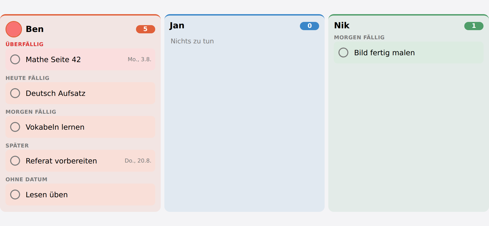

# Homework

Each child gets a Home Assistant **todo list**:

```
todo.hausaufgaben_ben
```

A `todo` list rather than something of Schoolday's own, because Home Assistant already
has a shape for "things still to do" — and it arrives with a voice interface, a card, a
calendar view and an API that Schoolday would only have reinvented worse. **Anything that
can talk to a todo list can put homework on it**: Assist, the built-in todo card, a
phone, an automation.

What Schoolday adds is whose list it is, and the sorting a school evening actually wants:
unfinished first, soonest first, undated last within its group — a thing with a deadline
is what has to be looked at, and an empty date is not an early one.

## The card

*Grouped by when it is due. The number beside each name is what is left.*


`schoolday-homework-card` is the reading end. It groups by **when the work is due**:

- Overdue
- Due today
- Due tomorrow
- Later
- No date

A flat list sorted by date answers the same question in principle, but at seven in the
morning reading dates is work and "today" is not. Inside "today" and "tomorrow" the date
beside each line is dropped again, because the heading already said it; overdue keeps it,
because *how* late matters.

Tapping a line ticks it off through `todo.update_item`, so the change is visible
everywhere, not just on this card.

## Finished work

Kept for a **fortnight**, then swept. Not for the child's benefit — so that *"did you do
the maths?"* on Thursday still has an answer on Friday.

Finished work is out of the way by default; `show_done: true` on the card brings it back.
