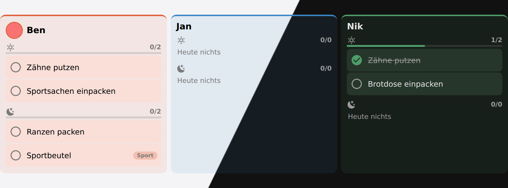

  

  <h1>The school week, on the kitchen wall</h1>
  

    Schoolday is a Home Assistant integration that owns the timetable rather than reading
    it from a calendar — then hands it to its own Lovelace cards, the morning routine, the
    packing list and your automations.
  

  

    <a class="hero-btn primary" href="installation.html">Install it</a>
    <a class="hero-btn" href="cards.html">See the cards</a>
    <a class="hero-btn" href="https://github.com/DomCim/HA-Schoolday">GitHub</a>
  

*The week for one child. Today is marked, the running lesson is picked out, and every
subject keeps the same colour everywhere else in the house.*

A timetable is fixed for a school year, and forty recurring events a week is not a
calendar anybody wants to maintain. So it is typed in once, and the board, the cards, the
sensors and the routines all read it from there.

It is built for one thing: a tablet on the kitchen wall that a family walks past.

## What it does

  <a class="tile" href="timetable.html">
    Timetable
    
The week per child, coloured by subject, with the running lesson marked. Schools on a
    two-week A/B rhythm included, down to which calendar week A starts in.

  </a>
  <a class="tile orange" href="routines.html">
    Routines
    
The things that simply have to happen, ticked off by the kids themselves — and the
    packing list that tomorrow's lessons generate on their own.

  </a>
  <a class="tile green" href="homework.html">
    Homework
    
A Home Assistant todo list per child, sorted by what is due first, with finished work
    kept for a fortnight so Thursday's question has an answer on Friday.

  </a>
  <a class="tile yellow" href="exceptions.html">
    Days that differ
    
Holidays, holiday care, school trips, a cancelled lesson, a substitution — and a child
    at home ill, which expires by itself instead of waiting to be switched off.

  </a>
  <a class="tile" href="automations.html">
    Automations
    
A sensor per child whose state is the subject they are in right now, events at every
    lesson boundary, and a service for everything the options dialog can change.

  </a>
  <a class="tile orange" href="cards.html">
    The cards
    
Six Lovelace cards that configure themselves. A card with no options at all is the
    normal case here, not the fallback.

  </a>

## A morning on the board

*Each child sees their own steps, and only the block that is running.*

The morning shows what has to happen before the door; the evening shows what has to be
packed for tomorrow. Nothing has to run at midnight for this to be right — a stale day
simply reads as "nothing done yet".

## Where to start

1. **[Install it](installation.md)** — through HACS, as a custom repository.
2. **[Set it up](installation.md#setting-it-up)** — family members, lesson times, one week per child.
3. **[Put the cards on a dashboard](cards.md)** — most of them take no configuration at all.

{: .tip }
> The [Goldammerweg setup](https://github.com/DomCim/HA-Schoolday/tree/main/examples/goldammerweg)
> is the household this is developed against — five people, three at school, a tablet in
> the kitchen. Entity ids and dashboard YAML included, so it reads as a worked example
> rather than a sample.

## Something not working, or missing

Something broken goes in an [issue](https://github.com/DomCim/HA-Schoolday/issues/new/choose) — the
form asks for the version and the log, which is what makes it answerable. Questions and ideas go in
[Discussions](https://github.com/DomCim/HA-Schoolday/discussions), and an idea becomes an issue once
there is a plan.

## What it is not

Not a school-management system, not a homework nag, and not a reward chart. Routines are
the things that have to happen whether or not anybody notices, and Schoolday does not
score them. It keeps [a record](routines.md#the-record) of what got done — but that is
for the grown-ups working out whether a routine is working, not a league table on the
wall.

It also does not talk to your school's portal. If yours has one the data may well be
reachable — but Schoolday holds what you type in, and that is what makes it work the same
in every country.
