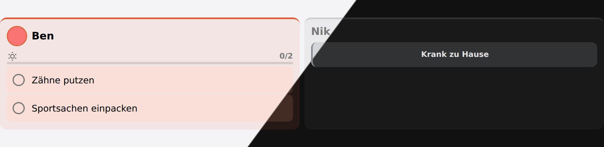

# Routines

A routine is the set of things that simply have to happen — brush teeth, pack the PE
kit. Each child has a **morning** and an **evening** list, and a separate list per
weekday, because Monday morning is not Friday morning.

Deliberately **not a reward system**. Routines are the things that have to happen
whether or not anybody notices, and Schoolday does not score them: no points, no stars,
nothing to earn by brushing your teeth.

It does keep [a record](#the-record) of what got done, and that is a different thing. It
is not on the wall for the children — it is for whoever has to work out whether the
evening routine is working, or whether it is the same two steps failing every week.


*Morning and evening for the whole family. "Sportbeutel" carries the subject that put it there.*

## Days that are not school days

A holiday morning is not a school morning with items crossed out — it is its own short
list. So the two kinds of day off get their own fields rather than a rule about which
steps to skip:

- **Day off** — the list for a holiday
- **Holiday care** — the list for a holiday spent in care, which needs the lunchbox but
  not the school bag

Leave **Holiday care** empty and care days fall back to the **Day off** list. Leave both
empty and holidays have no routine at all.



*A child at home ill keeps their place on the board, with the reason instead of a list*

A child [at home ill](exceptions.md#off-ill) has no list, and deliberately no fallback
either: a holiday list offers swimming things to a child in bed.

## What each subject needs

This is the one place the timetable and the routines know about each other.

"Pack the PE kit" typed into Monday evening states the same fact as Tuesday's timetable —
that there is PE on Tuesday. The copy is the one nobody updates when the timetable
changes, and a forgotten kit is not a subtle failure. So it is stated **once, per
subject**:

```
Sport      →  Sportbeutel, Turnschuhe
Schwimmen  →  Badesachen, Handtuch
```

Those appear in the **evening** routine on the day before that subject, for whoever has
it, and tick off exactly like any other step. A tomorrow that is a holiday, a care day or
a sick day asks for nothing — which is why Friday evening is quiet and Sunday evening is
not, with no rule about weekends anywhere.

A step somebody typed by hand **wins**: if you already have "Sportbeutel" in the routine,
the generated one is left out rather than shown twice. Delete the typed one to let the
timetable take over.

## Ticks reset overnight

Nothing has to run at midnight for that to be correct — a stored day that is not today
reads as "nothing done yet". The scheduled reset exists only so a wall panel visibly
clears itself.

## The record

Wiping the ticks every night is right for the board and throws away the only answer to
the question a parent actually has. So each day is **written down as it goes**: what the
board asked for, what got ticked, and what kind of day it was.

The last **30 days** are kept, and nothing older — long enough that every weekday has four
samples, short enough to stay a picture of how things are going rather than a permanent
file on a child. It is drawn by the [routine record card](cards.md#routine-record-card)
and published as `routine_stats` on each child's sensor.

Three rules decide what counts, and all three are about what does *not*:

- **A day that asked for nothing is not a day anybody failed.** A weekend, a holiday with
  no list, a day [at home ill](exceptions.md#off-ill) — none of them count against the
  rate, and none of them break a run of complete days.
- **Today counts only once it is finished.** An evening routine is 0 of 3 all morning. A
  rate that dips at breakfast and recovers at bedtime measures the clock, not the child.
- **A step only counts while it is in the routine.** Delete one and it stops being asked
  for; the days it was ticked on stay as they were.


```jinja
{{ state_attr('sensor.schoolday_ben', 'routine_stats').rate }}          {# 95 — whole percent #}
{{ state_attr('sensor.schoolday_ben', 'routine_stats').streak }}        {# 3 complete days in a row #}
{{ state_attr('sensor.schoolday_ben', 'routine_stats').steps[0].step }} {# the step most often skipped #}
```


`routine_stats` also carries `best_streak`, a `blocks` entry per morning and evening, and
`days` — one `{date, mode, asked, done}` per day, oldest first, today included so a card
can draw the day in progress. A rate is `null`, never `0`, where nothing was ever asked:
a child who has not been asked to do anything has not failed to do it.

## Services

| Service | Purpose |
|---|---|
| `schoolday.set_routine_step` | Tick a step off, or put it back. Takes a member name or id. |
| `schoolday.reset_routine` | Clear today's ticks, for one member or everyone. |
| `schoolday.set_materials` | Say what a subject needs brought along. |
