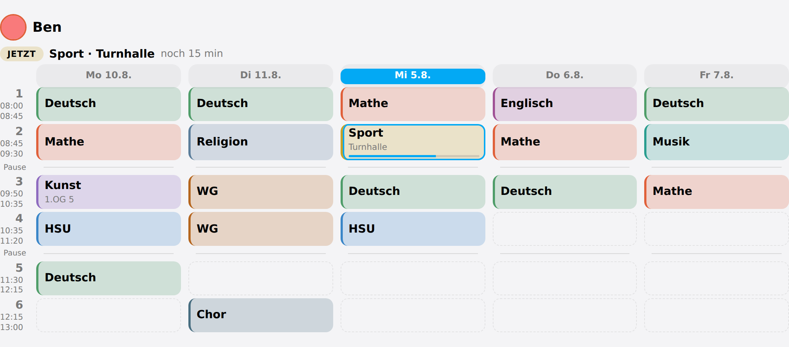
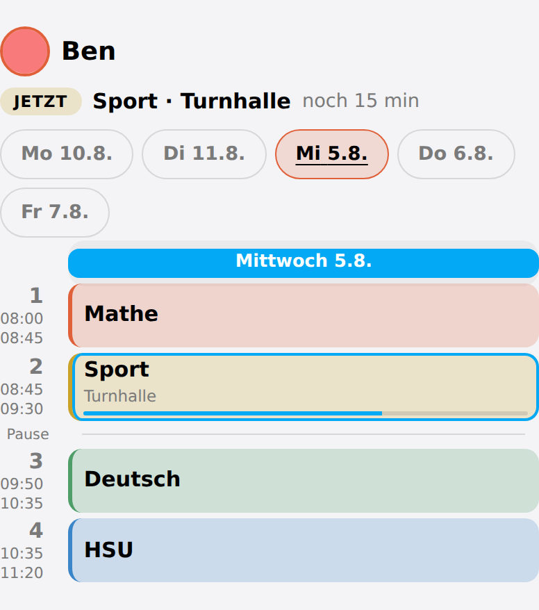
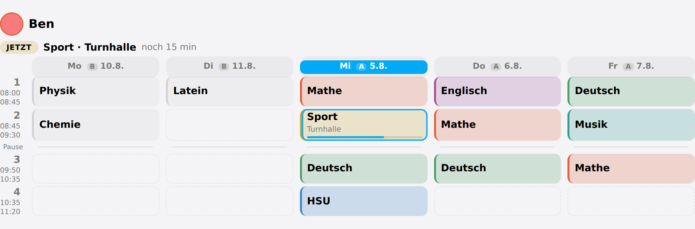

# Timetable

A timetable is fixed for a school year, which is why Schoolday stores it rather than
reading it from a calendar. Everything is typed in once and every card and every
automation reads it from there.



*A week: today highlighted, the running lesson outlined, free periods drawn rather than left out*

## Lesson times

One `HH:MM-HH:MM` per line, in order:

```
08:00-08:45
08:45-09:30
09:50-10:35
10:35-11:20
```

**Breaks come from the gaps.** Anything from five minutes upwards between two periods is
a break and is drawn as one — which is exactly the five-, ten- and sixty-minute gaps a
school day already has. There is nothing to configure.

These are the times a child gets when nothing else is said, which for most households is
everybody. A child whose day starts later at the *same* school simply has no lesson in the
first period.

## Two schools that do not ring together

A sibling at another school is a different matter: their first period may start at 08:15
and their morning break may be half an hour. Nothing in the grid above can say that, and
guessing it wrong is not cosmetic — it is the running-lesson line, the sensor state, and
the `schoolday_lesson_started` event all landing a quarter of an hour early.

So a second school gets its **own named times**, under **Configure → Another school's
lesson times** or in the timetable section of the [admin card](cards.md#admin-card):

```
Gymnasium
  08:15-09:00
  09:00-09:45
  10:15-11:00
```

Then put the children who go there on it, in their own form under **Edit a family
member**. Everybody else stays on the household's times without being asked.

Named after the school rather than kept per child, and that is the point: two siblings at
the same school share one entry, so a bell time that moves is typed once instead of twice.
It is the same reason [materials](routines.md#what-each-subject-needs) are held per subject
rather than per child.

From there everything follows the child. Their card draws their rows, their breaks come
out of *their* gaps, their sensor wakes at their boundaries, and their events fire when
their lessons actually start.

**Remove** takes a school away again, and asks first — naming the children it moves, because
"remove Gymnasium?" and "remove Gymnasium, and move Nik?" are different questions. They fall
back to the household's times rather than to none: a school deleted out from under a child
leaves them with a working timetable, which is the better of the two wrong answers.

In the options dialog, where there is no button to press, clearing that school's times
does the same thing.

## One week per child

Tap a cell and type the subject. A room can go with it.

In the options dialog the same week is a text field, one line per period:

```
Deutsch
Mathe
Kunst | 1.OG 5
-
Deutsch
```

- `-` leaves a period free
- `Fach | Raum` or `Fach @ Raum` puts the room next to the subject
- `5. Sport` names its period outright, so a day that starts at the third period does
  not need two placeholder lines first

{: .warning }
> **Subject names are exact strings** everywhere downstream: the sensor state, the colour,
> and whatever an automation compares against. `Sport` on Monday and `sport` on Wednesday
> would be two subjects with two colours — so when a week is saved, the first spelling in
> it wins for the whole week. Across two children it deliberately does not, because that
> would silently undo a rename.

## Colours

Every subject already has a colour, derived from its name by a stable hash. Maths is the
same colour on every child's card and stays that colour when the week is rewritten. The
colour editor is only ever a **correction**, which is why it offers the current colour
rather than an empty field.



*Too narrow for a week: the card falls back to one day and offers the others as chips*

## Two-week timetables

Some schools alternate an **A week** and a **B week**. Switch the cycle to two weeks and
say which **calendar week** week A starts in — the way a school says it. The editor then
has an A/B switch above the grid, and the display card marks every column with the week
it belongs to.



*A two-week timetable: every column says which week it belongs to, and Monday points at next week — which is a B week*

What gets **stored** is the Monday that week begins on, not the week number. An ISO year
has 52 or 53 weeks — 2026 has 53 — so "A is the odd weeks" would swap itself over some
new years and not others, and you would find out in February. A Monday keeps meaning the
same thing.

Turning the cycle back off does not throw week B away. It stops showing it.

```yaml
action: schoolday.set_cycle
data:
  weeks: 2
  iso_week: 37
```

## Which day a column means

A timetable repeats forever, so on its own a column can only say what a Tuesday is
usually like. Schoolday's columns point at **dates**: each one carries the date it
stands for, and by default a weekday that has already been rolls on to next week's — so
on Wednesday, the Monday column is next Monday.

Turn that off with `roll_days: false` on the card to see the week as it stands, past days
included.

Because a column is a date, everything dated follows from it without any extra option:
holidays, holiday care, a child at home ill, a cancelled period, and which week of an A/B
cycle you are looking at.
